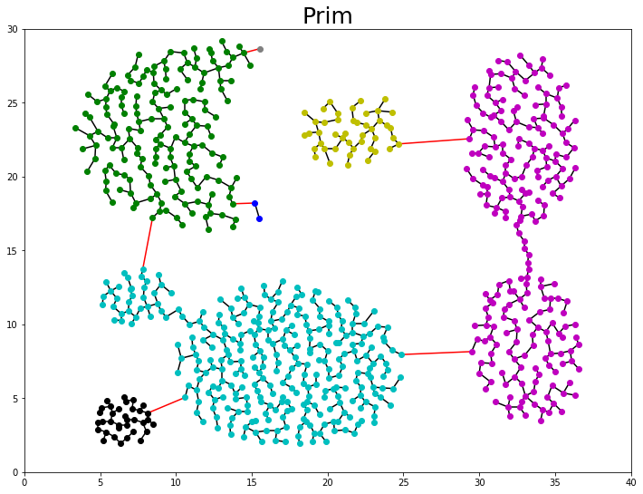

# Edge-clustering

Implementation of a clustering algorithm using an agregation criterion[1] where 
clusters are formed of connected components with the smallest edges possible,
that is, all of them are minimum spanning trees.



The hierarchy of modules is as follows

clustering
|---connected_components
|---prim
|---kruskall
    |---union_find

All the code is avaliable .py modules and as notebooks. 
The notebooks will be "recompiled" into .py modules when running the 'clustering' notebook in jupyter.
That notebook contains a demo run and visualizations.

The console use is throgh stdin/out to facilitate piping:

```console
$python(3) clustering.py [ ( kruskal | prim ) [ desired_number_of_clusters ] ] < data.txt > clusters.out
```

Note that this aggregation strategy has evident shortcommings wich are discussed alongside performance analysis in the [repport](relatorio2col.pdf) (in portuguese)

[1] Gionis,	 A.,	 H.	 Mannila,	 and	 P.	 Tsaparas,	 Clustering	 aggregation.	 ACM	 Transactions	 on	
Knowledge	Discovery	from	Data	(TKDD),	2007.	1(1):	p.	1-30.
